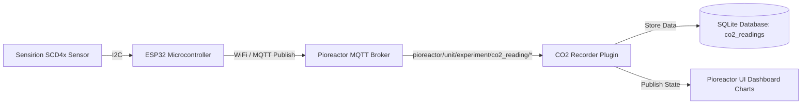

# Pioreactor CO2 Reading Plugin

The **CO2 Reading Plugin** enables real-time monitoring and recording of Carbon Dioxide ($\text{CO}_2$), ambient temperature, and relative humidity for bioreactor cultures. It interfaces an external **Sensirion SCD4x** sensor (SCD40 or SCD41) connected to an **ESP32** microcontroller, transmitting telemetry over Wi-Fi via MQTT to your [Pioreactor](https://pioreactor.com/) system.

---

## 📸 Architecture & Data Flow



### Key Features
1. **Dynamic Experiment Tracking**: The ESP32 subscribes to the Pioreactor's `$experiment` MQTT topic (`pioreactor/<UNIT>/$experiment`). When a new experiment is started in the Pioreactor web interface, the ESP32 automatically updates its internal state so readings are tagged with the active experiment name.
2. **Periodic Measurement**: Reads $\text{CO}_2$ (ppm), Temperature (°C), and Relative Humidity (%) every 30 seconds.
3. **Database Integration**: Automatically creates and manages the `co2_readings` table in the Pioreactor SQLite database.
4. **UI Dashboard Charts**: Includes pre-configured UI charts for $\text{CO}_2$ concentration, sensor temperature, and relative humidity directly in the Pioreactor web application.

---

## 🛠️ Hardware Requirements & Wiring

### Bill of Materials
- **ESP32 Development Board** (ESP32-WROOM-32 or similar)
- **Sensirion SCD4x Sensor Module** (SCD40 or SCD41 photoacoustic NDIR $\text{CO}_2$ sensor)
- **4x Female-to-Female Jumper Wires**
- **Micro-USB or USB-C Power Supply** (for ESP32)

### Wiring Diagram

| Sensirion SCD4x Pin | ESP32 Board Pin | Function |
| :--- | :--- | :--- |
| **VCC / VIN** | **3.3V** (or **5V** if module has onboard LDO regulator) | Power Supply |
| **GND** | **GND** | Ground |
| **SDA** | **GPIO 21** | I2C Data |
| **SCL** | **GPIO 22** | I2C Clock |

> [!NOTE]
> ESP32 default I2C pins are `GPIO 21` (SDA) and `GPIO 22` (SCL). If your breakout board operates on 5V, ensure it includes pull-up resistors to 3.3V or use the ESP32's 3.3V power output.

---

## ⚡ ESP32 Firmware Setup (`co2_esp.ino`)

### Prerequisites & Libraries
Open [`co2_esp.ino`](co2_esp.ino) using the **Arduino IDE** or **PlatformIO**. Install the required libraries via the Arduino Library Manager:

1. **PubSubClient** (by Nick O'Leary) - MQTT Client
2. **SensirionI2cScd4x** (by Sensirion) - SCD40/SCD41 I2C Driver
3. **WiFi** (Included with ESP32 board package)
4. **Wire** (Included with ESP32 board package)

### Firmware Configuration
Before flashing the firmware, edit lines 7–15 in [`co2_esp.ino`](co2_esp.ino) with your local network and Pioreactor details:

```cpp
// Wi-Fi credentials
const char *WIFI_SSID = "YOUR_WIFI_SSID";
const char *WIFI_PASSWORD = "YOUR_WIFI_PASSWORD";

// MQTT broker credentials & unit details
const char *MQTT_BROKER = "192.168.x.x";  // IP address of Pioreactor leader node
const int MQTT_PORT = 1883;
const char *MQTT_USER = "pioreactor";
const char *MQTT_PASSWORD = "raspberry";
const char *UNIT = "pioreactor01";         // Target Pioreactor unit name
```

### Flashing Procedure
1. Select board: **ESP32 Dev Module** (or your specific board variant).
2. Select the corresponding serial COM port.
3. Click **Upload** in the Arduino IDE.
4. Open the Serial Monitor at **115200 baud** to verify connection and diagnostic outputs:
   ```text
   Connecting to WiFi....
   WiFi connected: 192.168.1.105
   Connecting to MQTT...connected
   SCD4x started
   Experiment: my_experiment_name
   Published — CO2: 415ppm, Temp: 24.5C, Hum: 48.2%
   ```

---

## 🐍 Pioreactor Plugin Components

### 1. `co2_recorder.py`
The Python plugin defines a background job (`CO2Recorder`) that:
- Listens to MQTT topic `pioreactor/<unit>/+/co2_reading/+`.
- Ensures the SQLite table `co2_readings` exists with schema:
  - `experiment` (TEXT)
  - `pioreactor_unit` (TEXT)
  - `timestamp` (TEXT UTC)
  - `co2_reading_ppm` (REAL)
  - `temperature_c` (REAL)
  - `relative_humidity` (REAL)
- Updates published state variables (`latest_co2_ppm`, `latest_temperature_c`, `latest_relative_humidity`).

### 2. UI Dashboard Charts
The plugin provides three YAML configuration files for the Pioreactor web UI:
- `co2_ppm_chart.yaml`: Displays live and historical $\text{CO}_2$ levels in **ppm**.
- `co2_temperature_chart.yaml`: Displays temperature recorded by the SCD4x sensor in **°C**.
- `co2_humidity_chart.yaml`: Displays relative humidity in **%**.

---

## 🚀 Running the Plugin

### From the Pioreactor Command Line
Run the background job directly on your Pioreactor unit:

```bash
pio run co2_recorder
```

Optionally specify unit or experiment target overrides:

```bash
pio run co2_recorder --unit pioreactor01 --experiment my_experiment
```

### Automatic Execution
You can also launch `co2_recorder` via the Pioreactor web interface under **Jobs** / **Plugins** or include it in an experiment profile YAML file:

```yaml
experiment_profile_name: CO2 Monitored Culture

common:
  jobs:
    co2_recorder:
      actions:
        - type: start
```

---

## 📡 MQTT Topic Specification

| Topic Pattern | Direction | Description | Payload Format |
| :--- | :--- | :--- | :--- |
| `pioreactor/<UNIT>/$experiment` | ESP32 $\leftarrow$ Pioreactor | Active experiment name subscription | Plain string (e.g. `exp_2026_08_08`) |
| `pioreactor/<UNIT>/<EXPERIMENT>/co2_reading/co2` | ESP32 $\rightarrow$ Pioreactor | $\text{CO}_2$ concentration | Integer string in ppm (e.g. `420`) |
| `pioreactor/<UNIT>/<EXPERIMENT>/co2_reading/temperature` | ESP32 $\rightarrow$ Pioreactor | Sensor temperature | Float string in °C (e.g. `24.50`) |
| `pioreactor/<UNIT>/<EXPERIMENT>/co2_reading/relative_humidity` | ESP32 $\rightarrow$ Pioreactor | Relative humidity | Float string in % (e.g. `45.20`) |

---

## 🔍 Troubleshooting & Verification

1. **ESP32 failed to connect to MQTT broker**:
   - Verify that the Pioreactor MQTT broker IP address (`MQTT_BROKER`) is correct and reachable over your Wi-Fi network.
   - Check firewall rules on port `1883`.
2. **Readings are not appearing in the Database**:
   - Inspect active MQTT messages using Mosquitto CLI on the Pioreactor:
     ```bash
     mosquitto_sub -v -t "pioreactor/+/+/co2_reading/#"
     ```
3. **Database Queries**:
   - Check stored records directly in SQLite:
     ```bash
     sqlite3 /home/pi/.pioreactor/pioreactor.sqlite "SELECT * FROM co2_readings ORDER BY timestamp DESC LIMIT 10;"
     ```
