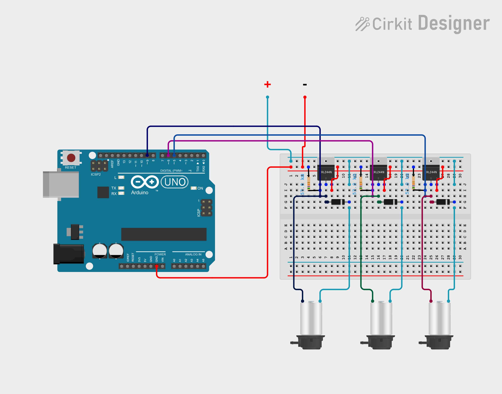

# Pioreactor Closed Loop (Continuous Flow) Plugin

The **Closed Loop (Continuous Flow) Plugin** enables continuous-flow fluid circulation across multiple [Pioreactor](https://pioreactor.com/) units and an external reservoir/beaker. It controls three external DC peristaltic pumps using an **Arduino Uno R4 WiFi** connected via MQTT to the Pioreactor network.

---

## 📸 System Architecture & Fluidic Topology

### Fluidic Circulation Loop
The system forms a closed-loop continuous flow culture system designed to maintain constant volume across two bioreactors (`pio01` and `pio02`) and a media/waste reservoir (external beaker):


### Control & Telemetry Flow


---

## 🛠️ Hardware Requirements & Wiring

### Bill of Materials
- **Arduino Board**: Arduino Uno R4 WiFi (or ESP32/ESP8266 running compatible firmware)
- **Pumps**: 3x 12V DC Peristaltic Pumps
- **Drivers**: 3x N-channel MOSFET modules or transistor switches (e.g., IRF520 / MOSFET breakout boards)
- **Power Supply**: External 12V DC Power Supply (sized for total pump current draw, e.g., 12V 2A-5A)
- **Protection**: 3x Flyback Diodes (e.g., 1N4007) across pump motor terminals to suppress inductive spikes
- **Tubing**: Silicone tubing suitable for peristaltic pumps and culture media

### Circuit Wiring Diagram



### Wiring & Pinout Table

| Arduino Uno R4 Pin | Component / Connection | Function |
| :--- | :--- | :--- |
| **Pin D5** (PWM) | MOSFET 1 Gate | Controls Pump 1 (`pio01` $\rightarrow$ `pio02`) |
| **Pin D6** (PWM) | MOSFET 2 Gate | Controls Pump 2 (`pio02` $\rightarrow$ external beaker) |
| **Pin D9** (PWM) | MOSFET 3 Gate | Controls Pump 3 (external beaker $\rightarrow$ `pio01`) |
| **GND** | External 12V DC GND & MOSFET GND | **Common Ground Connection** |

> [!IMPORTANT]
> Always connect the **GND** of the external 12V power supply to the **GND** pin of the Arduino. Ensure flyback diodes are placed in parallel across each pump motor to protect the MOSFETs from voltage spikes.

---

## ⚡ Arduino Firmware Setup (`circulation_pump_controller.ino`)

### Prerequisites & Libraries
Open [`circulation_pump_controller.ino`](circulation_pump_controller.ino) in the Arduino IDE or PlatformIO. Ensure the following libraries are installed:

1. **WiFiS3** (Included with Arduino UNO R4 Board Package)
2. **ArduinoMqttClient** (by Arduino - install via Library Manager)

### Firmware Configuration
Edit lines 22–29 in [`circulation_pump_controller.ino`](circulation_pump_controller.ino) with your local network settings:

```cpp
const char* WIFI_SSID     = "YOUR_WIFI_SSID";
const char* WIFI_PASSWORD = "YOUR_WIFI_PASSWORD";

const char* MQTT_BROKER = "10.102.100.34";  // IP address of Pioreactor leader node
const int   MQTT_PORT   = 1883;
const char* MQTT_USER   = "pioreactor";
const char* MQTT_PASS   = "raspberry";
const char* MQTT_TOPIC  = "pioreactor/circulation_pump/run";
```

### Pump Calibration & Speed Control
The PWM duty cycle is set via the global constant `PUMP_LEVEL`:

```cpp
// Validated via bench test: 65-70 runs smoothly without stalling.
const int PUMP_LEVEL = 67; // PWM duty cycle (0-255)
```

- When payload `"1"` is received on `pioreactor/circulation_pump/run`, all three PWM pins (`5`, `6`, `9`) are driven at `PUMP_LEVEL`.
- When payload `"0"` is received, all three PWM outputs are set to `0` (off).

### Flashing Procedure
1. Connect Arduino Uno R4 WiFi via USB.
2. Select Board: **Arduino UNO R4 WiFi**.
3. Select the COM / TTY port.
4. Click **Upload**.

---

## 🐍 Pioreactor Python Plugin & UI Integration

### 1. Python Background Job (`circulation_pump.py`)
The plugin registers a Pioreactor `BackgroundJob` subclass called `CirculationPump`:

- **Flat MQTT Topic**: `pioreactor/circulation_pump/run` (flat topic since the loop spans multiple units).
- **Published Setting**: `circulating` (`boolean`, `settable=True`).
- **Fail-Safe Mechanism**: Implements `on_disconnected()`, which automatically sends `"0"` with `retain=True` to shut off all pumps if the background job crashes or is stopped.

### 2. Web UI Card (`circulation_pump.yaml`)
Exposes a UI card in the Pioreactor web interface under **Activities / Plugins**:
- Displays job state and provides a toggle button for `circulating`.

---

## 🚀 Running the Plugin

### From the Command Line
Start the circulation pump controller on any Pioreactor node:

```bash
pio run circulation_pump
```

### Web UI
1. Navigate to the Pioreactor UI dashboard.
2. Find the **Circulation Pump** card.
3. Toggle the **Circulating** switch to `ON` or `OFF`.

### Automated Experiment Profile Integration
To run the continuous flow circulation automatically during an experiment, add it to an experiment profile:

```yaml
experiment_profile_name: Continuous Flow Closed Loop Culture

common:
  jobs:
    circulation_pump:
      actions:
        - type: start
        - type: update
          hours: 0.1
          options:
            circulating: true
        - type: stop
          hours: 24.0
```

---

## 📡 MQTT Topic Specification

| Topic | Direction | Payload | Description |
| :--- | :--- | :--- | :--- |
| `pioreactor/circulation_pump/run` | Pioreactor $\rightarrow$ Arduino | `"1"` (ON) / `"0"` (OFF) | Retained message controlling pump state across all 3 motors |

---

## 🔍 Safety & Operational Checklist

1. **Tubing Priming**: Ensure all fluidic lines are fully primed before turning on `circulating` mode to prevent air bubbles and uncalibrated volume transfer.
2. **Fail-Safe Operation**: If network connectivity is lost, the Arduino continues its last received state until reconnected or power-cycled. When the Python job exits cleanly, it guarantees a `"0"` payload is published to prevent overflow.
3. **Flow Calibration**: Verify flow rates of all three pumps at PWM level `67` to ensure balanced volume movement between `pio01`, `pio02`, and the external beaker.
