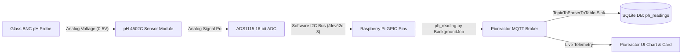
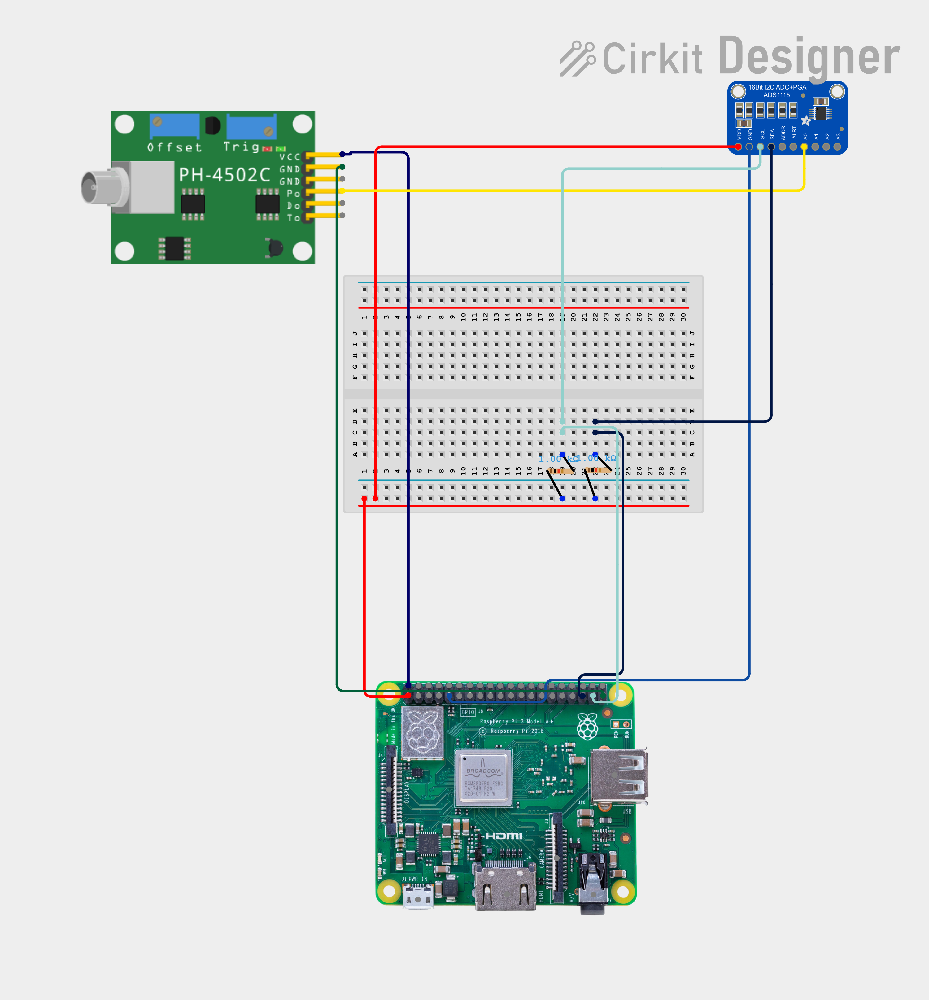

# Pioreactor pH Reading Plugin

The **pH Reading Plugin** enables continuous, real-time pH monitoring for bioreactor cultures in the [Pioreactor](https://pioreactor.com/) system. It interfaces a **pH 4502C** sensor board (with a glass BNC probe) connected to an **ADS1115** (or ADS1114) 16-bit Analog-to-Digital Converter (ADC) running on a dedicated **Software I2C Bus** on the Raspberry Pi's GPIO header.

---

## 📸 System Architecture & Data Flow



---

## 🔌 Hardware Requirements & Wiring

### Bill of Materials
- **pH Sensor Module**: pH 4502C Sensor Board
- **pH Probe**: Standard Glass Electrode BNC pH Probe
- **ADC Converter**: ADS1115 (or ADS1114) 16-Bit I2C ADC Module
- **Raspberry Pi**: Pioreactor Raspberry Pi with free GPIO pins
- **Jumpers**: Female-to-Female DuPont wires

### Circuit Diagram



### Wiring Diagram Table

| Component Pin | Connection Target | Function |
| :--- | :--- | :--- |
| **pH 4502C VCC** | Raspberry Pi 5V (Pin 2 or 4) | Sensor Power (5V) |
| **pH 4502C GND** | Common Ground (Pin 6, 9, 14, or 20) | Ground |
| **pH 4502C Po** | ADS1115 Channel **A0** | Analog pH Voltage Output |
| **ADS1115 VDD** | Raspberry Pi 3.3V (Pin 1 or 17) | ADC Power (3.3V) |
| **ADS1115 GND** | Common Ground | Ground |
| **ADS1115 SDA** | Raspberry Pi **GPIO 23** (Pin 16) | Software I2C Data Line |
| **ADS1115 SCL** | Raspberry Pi **GPIO 24** (Pin 18) | Software I2C Clock Line |
| **ADS1115 ADDR**| Common Ground | Sets I2C Address to `0x48` |

> [!NOTE]
> The pH 4502C board requires a 5V power supply for optimal internal offset amplification, while the ADS1115 VDD is powered by 3.3V to safely match the Raspberry Pi 3.3V logic level on SDA/SCL lines.

---

## 🛠️ Software I2C Bus Configuration (`i2c-gpio`)

### Why a Dedicated Software I2C Bus?
The Pioreactor HAT uses the Raspberry Pi's primary hardware I2C bus (`/dev/i2c-1`) for onboard peripherals (DACs, ADCs, PWM drivers, EEPROM). Connecting an external ADS1115 ADC to free GPIO pins via a secondary **Software I2C bus** (`/dev/i2c-3`) avoids I2C bus contention, address collisions, and timing interference.

### Creating the Software I2C Bus
1. Open the Raspberry Pi boot configuration file:
   ```bash
   sudo nano /boot/firmware/config.txt
   # (Or /boot/config.txt on older Raspberry Pi OS versions)
   ```
2. Add the following Device Tree Overlay line to configure GPIO 23 as SDA and GPIO 24 as SCL on software bus `3`:
   ```ini
   dtoverlay=i2c-gpio,bus=3,i2c_gpio_sda=23,i2c_gpio_scl=24
   ```
3. Save the file and reboot the Pioreactor:
   ```bash
   sudo reboot
   ```
4. Verify that software bus `3` is active and the ADS1115 is detected at address `0x48`:
   ```bash
   sudo i2cdetect -y 3
   ```
   You should see `48` listed in the detection grid.

---

## 🧮 pH Calibration & Physics Model

The ADS1115 reads the analog voltage $V_{\text{read}}$ from the pH 4502C board at $A0$. The voltage is converted to pH using a linear calibration formula:

$$\text{pH} = 7.0 + \frac{V_{\text{pH7}} - V_{\text{read}}}{\text{Slope}}$$

Where:
- $V_{\text{pH7}}$: Voltage measured when the probe is placed in a neutral pH 7.0 buffer solution (default `2.5` V).
- $\text{Slope}$: Change in voltage per unit pH change (default `0.1816` V/pH).

### Configuring Calibration in `config.ini`
You can customize the calibration parameters in your Pioreactor `config.ini` file under the `[ph_reading.config]` section:

```ini
[ph_reading.config]
interval=30.0
voltage_at_ph7=2.500
slope=0.1816
i2c_bus=3
```

---

## 🐍 Pioreactor Plugin Components

### 1. `ph_reading.py`
The Python module registers a background job `PHReading` (`BackgroundJobContrib`):
- **Periodic Timer**: Reads raw ADC values every `interval` seconds (default 30s).
- **MQTT Publishing**: Publishes JSON payload `{"ph": <float>, "voltage": <float>}` to topic:
  `pioreactor/<unit>/<experiment>/ph_reading/reading`
- **Automatic Database Streaming**: Uses `register_source_to_sink` and `produce_metadata` to automatically write incoming MQTT payloads into the `ph_readings` SQLite database table.

### 2. Database Schema (`ph_readings`)
```sql
CREATE TABLE IF NOT EXISTS ph_readings (
    experiment      TEXT NOT NULL,
    pioreactor_unit TEXT NOT NULL,
    timestamp       TEXT NOT NULL,
    ph_reading      REAL NOT NULL,
    voltage         REAL NOT NULL,
    FOREIGN KEY (experiment) REFERENCES experiments (experiment) ON DELETE CASCADE
);

CREATE INDEX IF NOT EXISTS ph_readings_ix ON ph_readings (experiment, pioreactor_unit, timestamp);
```

### 3. Web UI Integration
- **UI Card (`ui/ph_readings.yaml`)**: Appears on the Pioreactor Web UI under **Activities / Plugins**. Displays live status and allows adjusting the sampling interval dynamically.
- **UI Chart (`charts/ph_readings.yaml`)**: Renders real-time and historical pH curves ($0.0 - 14.0$ domain) directly in the UI.
- **Data Exporter (`exportable_datasets/ph_readings.yaml`)**: Registers `ph_readings` as an exportable dataset in the Pioreactor Web UI CSV/Excel exporter.

---

## 🚀 Running the Plugin

### From the Command Line
Start the pH reader directly on your Pioreactor unit:

```bash
pio run ph_reading
```

### Automated Profile Integration
Include `ph_reading` in an experiment profile YAML:

```yaml
experiment_profile_name: Monitored pH Fermentation

common:
  jobs:
    ph_reading:
      actions:
        - type: start
        - type: update
          options:
            interval: 15.0
```

---

## 📡 MQTT Topic Specification

| Topic | Direction | Payload Example | Description |
| :--- | :--- | :--- | :--- |
| `pioreactor/<UNIT>/<EXPERIMENT>/ph_reading/reading` | Pioreactor $\rightarrow$ MQTT | `{"ph": 7.12, "voltage": 2.4781}` | Periodic pH & raw voltage payload |

---

## 🔍 Troubleshooting & Probe Calibration Step-by-Step

1. **Software I2C Bus Not Found**:
   - Verify `/boot/firmware/config.txt` has `dtoverlay=i2c-gpio,bus=3,i2c_gpio_sda=23,i2c_gpio_scl=24`.
   - Ensure the `i2c-dev` kernel module is loaded (`ls /dev/i2c-3`).
2. **Two-Point Calibration Procedure**:
   - **Step 1**: Submerge the probe in **pH 7.0 buffer**. Record the published voltage $V_7$. Set `voltage_at_ph7 = V7` in `config.ini`.
   - **Step 2**: Submerge the probe in **pH 4.0 buffer**. Record the published voltage $V_4$. Calculate slope: $\text{slope} = \frac{V_7 - V_4}{7.0 - 4.0}$. Set `slope` in `config.ini`.
3. **Database Records Inspection**:
   ```bash
   sqlite3 /home/pi/.pioreactor/pioreactor.sqlite "SELECT * FROM ph_readings ORDER BY timestamp DESC LIMIT 5;"
   ```
