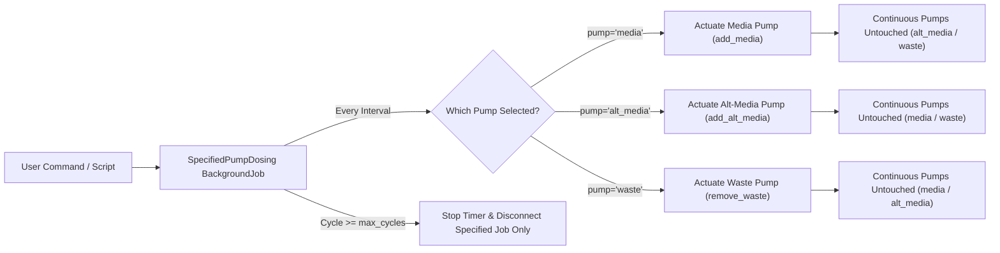

# Specified Pump Dosing Plugin

The **Specified Pump Dosing Plugin** executes a sequence of doses using any user-selected pump (`media`, `alt_media`, or `waste`) on the [Pioreactor](https://pioreactor.com/) system. It runs for a specified number of cycles and shuts down **only the designated pump** upon completion, leaving all other running pumps (such as continuous media and waste pumps) completely untouched and active.

---

## 📸 Architecture & Workflow



---

## 🌟 Why Other Pumps Stay Running (Isolation Architecture)

In standard Pioreactor Dosing Automations (`DosingAutomationJobContrib`), stopping or disconnecting the automation triggers an emergency master shutdown hook that halts all active pumps on the unit to prevent overflowing the vial.

This plugin instead inherits from **`BackgroundJobContrib`**:
1. **No Master Dosing Hook**: It runs as an independent background job process. When it disconnects, Pioreactor's automation manager does not issue a global pump shutdown.
2. **No Hardware PWM Controller Reset**: Individual pump doses (`add_media`, `add_alt_media`, `remove_waste`) are atomic and automatically turn off their own pin once the dose finishes. We do not re-initialize or reset the shared hardware PWM controller chip on exit, leaving other PWM channels active.
3. **True Continuous Operation**: You can have `media` and `waste` pumps running continuously from the UI (e.g. for chemostat/washout) while running a targeted pulse sequence on `alt_media`. When the `alt_media` sequence completes, your continuous flow continues without a hiccup.

---

## ⚙️ Configuration Parameters

| Parameter | Type | Default | Description |
| :--- | :---: | :---: | :--- |
| `pump` | `string` | `"media"` | Target pump to actuate: `"media"`, `"alt_media"`, or `"waste"`. |
| `duration` | `float` | `20.0` | Schedule interval in minutes between dosing steps. |
| `volume_sequence` | `string` | `""` | Comma/space-separated list of volumes in mL (e.g. `"0.05, 0.10, 0.20, 0.25, 0.20, 0.10"`). |
| `default_volume_ml` | `float` | `0.10` | Fixed volume used if `volume_sequence` is not provided. |
| `max_cycles` | `integer` | `len(sequence)` | Total cycles to run before auto-stopping. If `0`, runs indefinitely. |

---

## 🚀 How to Run

### Standalone CLI Execution
Run directly from the terminal. This is the recommended mode when you are running other continuous pumps:

```bash
# Example: 6 cycles on alt_media pump (e.g. salt / inducer pulses) every 15 minutes
pio run specified_pump_dosing \
    --pump alt_media \
    --duration 15 \
    --volume-sequence "0.05, 0.10, 0.15, 0.15, 0.10, 0.05" \
    --max-cycles 6
```

```bash
# Fast Test: 2 quick doses (6s apart) on alt_media while other pumps run continuously
pio run specified_pump_dosing \
    --pump alt_media \
    --duration 0.1 \
    --volume-sequence "0.05, 0.05" \
    --max-cycles 2
```

---

## 📊 Database Logging

All doses executed by this plugin are logged to a dedicated SQLite table: `specified_pump_dosing_records`.

### Schema
```sql
CREATE TABLE IF NOT EXISTS specified_pump_dosing_records (
    experiment       TEXT NOT NULL,
    pioreactor_unit  TEXT NOT NULL,
    timestamp        TEXT NOT NULL,
    cycle            INTEGER NOT NULL,
    pump             TEXT NOT NULL,
    volume_ml        REAL NOT NULL
);
```

### Querying Dosing History
```bash
sqlite3 /home/pioreactor/.pioreactor/storage/pioreactor.sqlite \
  "SELECT timestamp, cycle, pump, volume_ml FROM specified_pump_dosing_records ORDER BY timestamp DESC LIMIT 10;"
```
